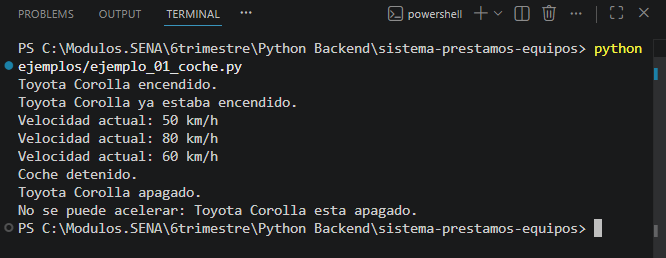
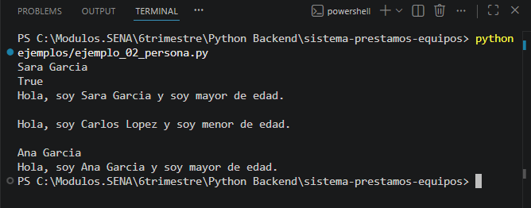
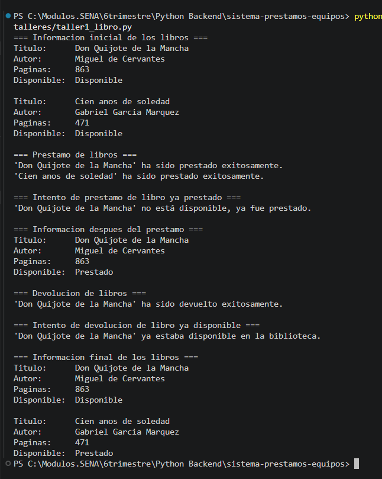
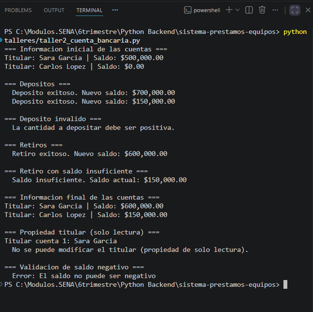

# Sistema de Préstamos de Equipos

**Autora:** Sara García\
**Curso:** Programación en Python\
**Institución:** SENA\
**Actividad:** GA1-220501093-04-AA1-EV04

------------------------------------------------------------------------

## Estructura del Repositorio

    sistema-prestamos-equipos/
    │
    ├── README.md
    ├── capturas/
    │   ├── ejemplo1.png
    │   ├── ejemplo2.png
    │   ├── taller1_libro.png
    │   ├── taller2_cuenta_bancaria.png
    │   ├── proyecto1_inventario.png
    │   ├── proyecto2_prestamo.png
    │   ├── proyecto3_historial.png
    │   └── proyecto4_devolucion.png
    │
    ├── ejemplos/
    │   ├── ejemplo_01_coche.py
    │   ├── ejemplo_02_persona.py
    │   ├── ejemplo_03_producto.py
    │   ├── ejemplo_04_rectangulo.py
    │   ├── ejemplo_05_cuenta.py
    │   ├── ejemplo_06_libro.py
    │   ├── ejemplo_07_estudiante.py
    │   ├── ejemplo_08_temperatura.py
    │   ├── ejemplo_09_calculadora.py
    │   ├── ejemplo_10_fecha.py
    │   ├── ejemplo_11_punto.py
    │   ├── ejemplo_12_empleado.py
    │   ├── ejemplo_13_cuenta_bancaria.py
    │   ├── ejemplo_14_producto_getters.py
    │   ├── ejemplo_15_persona_getters.py
    │   ├── ejemplo_16_temperatura_property.py
    │   ├── ejemplo_17_circulo.py
    │   ├── ejemplo_18_empleado_property.py
    │   ├── ejemplo_19_vehiculo_herencia.py
    │   └── ejemplo_20_formulario.py
    │
    ├── talleres/
    │   ├── taller1_libro.py
    │   └── taller2_cuenta_bancaria.py
    │
    └── proyecto_final/
        └── prestamos_equipos.py

------------------------------------------------------------------------

## Ejemplos de Ejecución

### Ejemplos

  Archivo                 Captura
  ----------------------- ----------------------------
  ejemplo_01_coche.py     
  ejemplo_02_persona.py   

### Talleres

  -------------------------------------------------------------------------------
  Archivo                             Captura
  ----------------------------------- -------------------------------------------
  taller1_libro.py                    

  taller2_cuenta_bancaria.py          
  -------------------------------------------------------------------------------

### Proyecto Final

  Opción       Captura
  ------------ ----------------------------------------
  Inventario   
  Préstamo     
  Historial    
  Devolución   

------------------------------------------------------------------------

## Cómo Ejecutar

``` bash
python ejemplos/ejemplo_01_coche.py
python talleres/taller1_libro.py
python proyecto_final/prestamos_equipos.py
```

------------------------------------------------------------------------

## Reflexión

Este proyecto me permitió entender cómo aplicar la Programación
Orientada a Objetos en un caso real. Aprendí a organizar mejor el código
usando clases, proteger datos con encapsulación y trabajar con
estructuras como listas y diccionarios.
