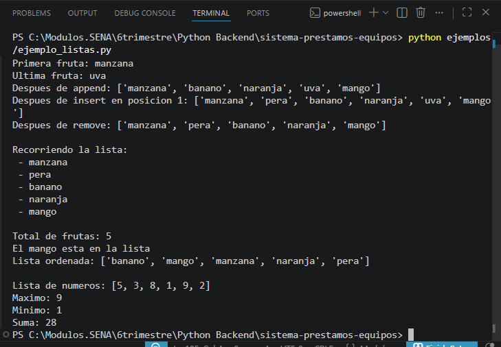
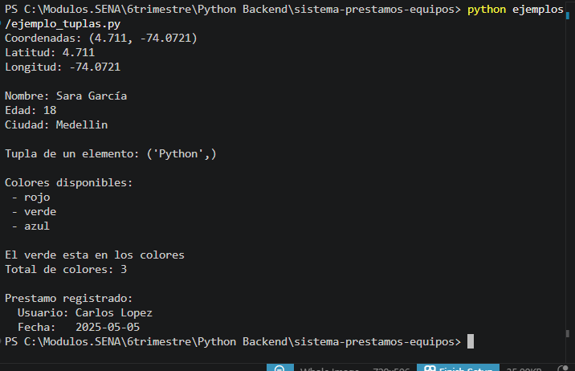
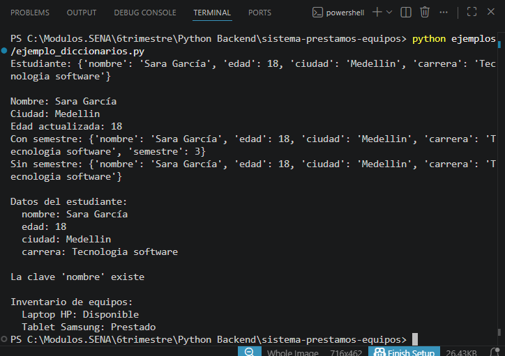
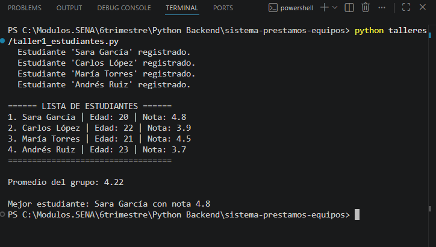
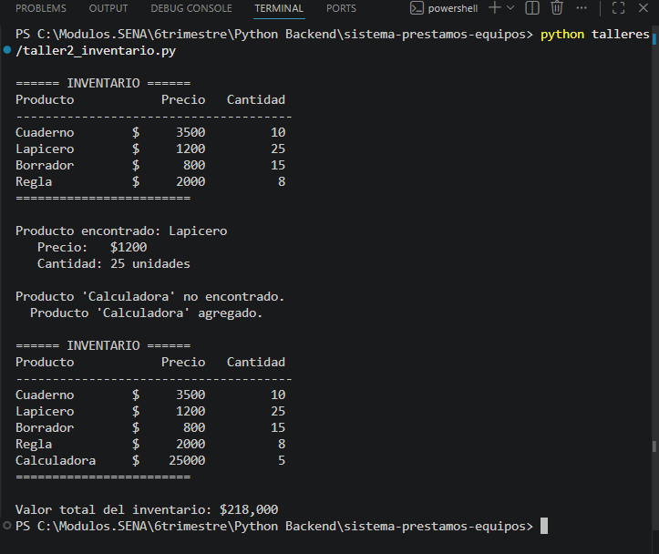
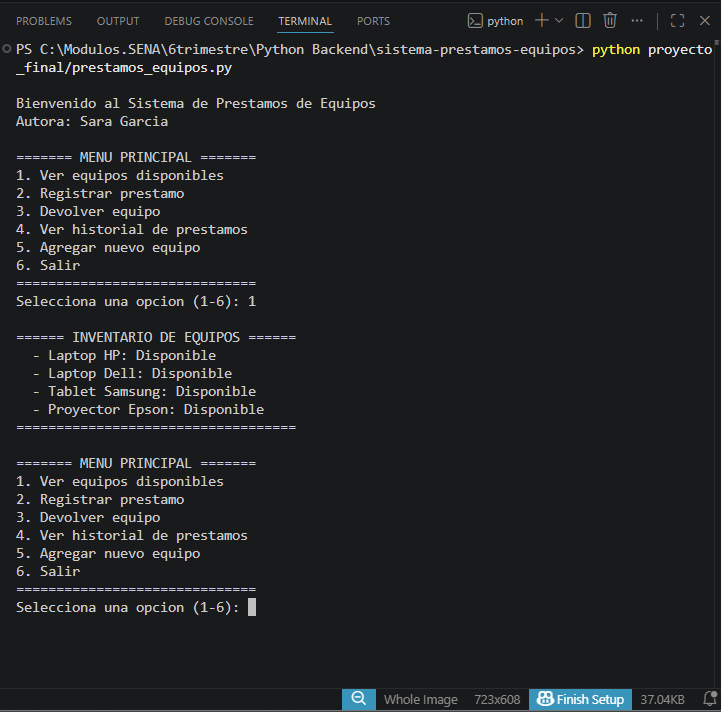
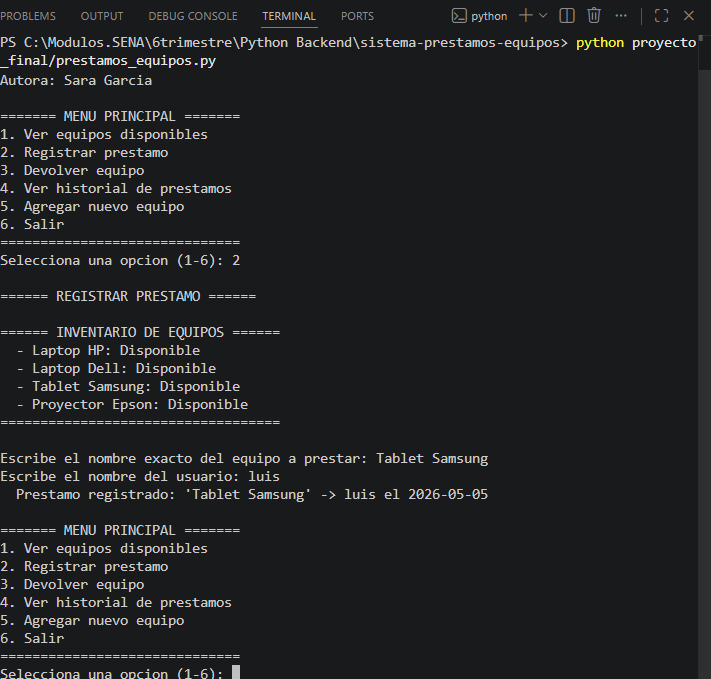
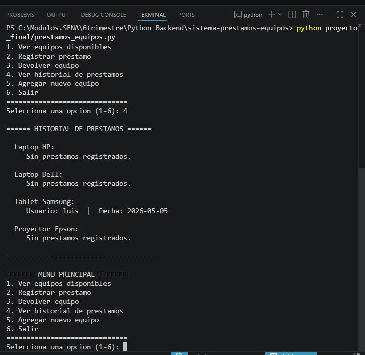
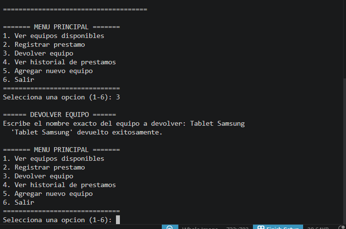

# Sistema de Préstamos de Equipos

**Autora:** Sara García  
**Curso:** Programación en Python  
**Institución:** SENA  
**Actividad:** GA1-220501093-04-AA1-EV04

---

## Estructura del Repositorio

```
sistema-prestamos-equipos/
│
├── README.md
├── capturas/
│   ├── lista1_listas.png
│   ├── lista2_tuplas.png
│   ├── lista3_diccionarios.png
│   ├── taller1_estudiantes.png
│   ├── taller2_inventario.png
│   ├── proyecto1_inventario.png
│   ├── proyecto2_prestamo.png
│   ├── proyecto3_historial.png
│   └── proyecto4_devolucion.png
├── ejemplos/
│   ├── ejemplo_listas.py
│   ├── ejemplo_tuplas.py
│   └── ejemplo_diccionarios.py
├── talleres/
│   ├── taller1_estudiantes.py
│   └── taller2_inventario.py
└── proyecto_final/
    └── prestamos_equipos.py
```

---

## Diseño de Clases y Encapsulación

El proyecto aplica Programación Orientada a Objetos con tres clases principales que se comunican entre sí.

### Clase `Prestamo`

Representa un préstamo individual. Sus atributos son privados (`__`) para proteger los datos de modificaciones externas.

```python
class Prestamo:
    def __init__(self, usuario, fecha):
        self.__usuario = usuario   # Atributo privado
        self.__fecha = fecha       # Atributo privado

    def get_usuario(self):
        return self.__usuario

    def get_fecha(self):
        return self.__fecha
```

### Clase `Equipo`

Representa cada equipo del inventario. Controla su propio estado (disponible o prestado) y guarda su historial de préstamos.

```python
class Equipo:
    def __init__(self, nombre):
        self.__nombre = nombre
        self.__disponible = True
        self.__historial = []      # Lista de objetos Prestamo

    def prestar(self, usuario):
        if self.__disponible:
            prestamo = Prestamo(usuario, date.today())
            self.__historial.append(prestamo)
            self.__disponible = False

    def devolver(self):
        self.__disponible = True
```

### Clase `SistemaPrestamos`

Clase principal. Contiene el inventario completo y el menú de opciones. Coordina las interacciones entre `Equipo` y `Prestamo`.

```python
class SistemaPrestamos:
    def __init__(self):
        self.__equipos = {
            "Laptop HP": Equipo("Laptop HP"),
            "Laptop Dell": Equipo("Laptop Dell"),
            "Tablet Samsung": Equipo("Tablet Samsung"),
            "Proyector Epson": Equipo("Proyector Epson"),
        }
```

### ¿Por qué encapsulación?

Los atributos privados (`__nombre`, `__disponible`, `__historial`) no se pueden modificar directamente desde fuera de la clase. Solo se accede a ellos a través de métodos (`getters`). Esto protege la integridad de los datos: nadie puede cambiar el estado de un equipo sin pasar por el método `prestar()` o `devolver()`.

---

## Ejemplos de Ejecución en Consola

### Ejemplos — Listas, Tuplas y Diccionarios

| Archivo | Captura |
|---------|---------|
| `ejemplo_listas.py` |  |
| `ejemplo_tuplas.py` |  |
| `ejemplo_diccionarios.py` |  |

### Talleres — Clases y Encapsulación

| Archivo | Captura |
|---------|---------|
| `taller1_estudiantes.py` |  |
| `taller2_inventario.py` |  |

### Proyecto Final — Sistema de Préstamos de Equipos

| Opción del menú | Captura |
|-----------------|---------|
| Opción 1 — Ver equipos disponibles |  |
| Opción 2 — Registrar préstamo |  |
| Opción 4 — Ver historial |  |
| Opción 3 — Devolver equipo |  |

---

## Conceptos Aplicados

| Concepto | Dónde se aplica |
|----------|-----------------|
| Clases y objetos | `Prestamo`, `Equipo`, `SistemaPrestamos` |
| Encapsulación | Atributos privados con `__` y métodos getters |
| Listas | `__historial` dentro de cada `Equipo` |
| Tuplas | Concepto base de `Prestamo` (datos inmutables) |
| Diccionarios | `__equipos` en `SistemaPrestamos` |
| Métodos | `prestar()`, `devolver()`, `ver_historial()`, etc. |

---

## Cómo Ejecutar

```bash
# Ejemplos
python ejemplos/ejemplo_listas.py
python ejemplos/ejemplo_tuplas.py
python ejemplos/ejemplo_diccionarios.py

# Talleres
python talleres/taller1_estudiantes.py
python talleres/taller2_inventario.py

# Proyecto final
python proyecto_final/prestamos_equipos.py
```

---

## Reflexión Personal

Durante este curso aprendí a ver los datos de una forma más organizada. Al principio me costó entender por qué usar listas, tuplas y diccionarios en lugar de simples variables, pero con el proyecto final entendí que cada estructura tiene un propósito: la lista para guardar cosas que crecen, la tupla para datos que no deben cambiar, y el diccionario para buscar información rápidamente por nombre.

El reto más grande fue aprender la Programación Orientada a Objetos. Al principio me confundían los conceptos de clase, objeto y método, pero cuando lo comparé con la vida real —un equipo es un objeto, prestar es una acción que hace ese objeto— empezó a tener sentido.

Lo que más me gustó fue ver cómo el código quedó mucho más organizado con POO que con funciones sueltas. Cada clase tiene su responsabilidad clara, y eso hace el programa más fácil de entender y de modificar en el futuro. También entendí la importancia de la encapsulación: proteger los datos evita errores y hace el código más confiable.